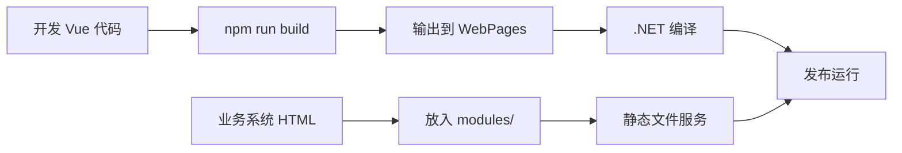

# QMSystem 前端项目

## 📁 目录结构

```
QMSystem-UI/                    # Vue 3 前端源码（开发用）
├── src/                   # Vue 源码
│   ├── views/            # 页面组件
│   ├── components/       # 通用组件
│   ├── stores/          # Pinia 状态管理
│   └── main.js          # 入口文件
├── package.json          # 依赖配置
├── vite.config.ts        # Vite 构建配置
└── README.md            # 本文档

QMSystem/WebPages/        # 编译产物（生产用）
├── index.html           # 主页面
├── login.html          # 登录页面
├── assets/             # 编译后的静态资源
└── modules/            # 业务系统页面
```

## 🚀 开发流程

### 1. 安装依赖
```bash
cd QMSystem-UI
npm install
```

### 2. 开发模式（前后端分离）
```bash
# 终端1：启动后端
cd QMSystem
dotnet run

# 终端2：启动前端（热重载）
cd QMSystem-UI
npm run dev
```

访问：`http://localhost:5173`

### 3. 生产构建
```bash
cd QMSystem-UI
npm run build
```

构建产物会自动输出到 `../QMSystem/WebPages/`

## 🔧 架构特点

### 源码保护
- `QMSystem-UI/` 存放 Vue 源码（开发环境）
- `WebPages/` 只存放编译产物（生产环境）
- 发布时可删除 `QMSystem-UI/`，保护源码

### 自动化构建
- VS 中点击"启动"时自动构建前端
- MSBuild 预构建指令确保前端始终最新

### 业务系统集成
- 动态路由：`/modules/:system/:page`
- iframe 容器：统一的业务页面布局
- 静态文件服务：优先从文件系统提供业务页面

## 📝 开发规范

### 添加新页面
1. 在 `src/views/` 创建 Vue 组件
2. 在 `src/main.js` 添加路由
3. 运行 `npm run build` 更新生产文件

### 添加业务系统
1. 在 `QMSystem/WebPages/modules/` 创建业务系统目录
2. 放入 HTML 文件
3. 访问：`/modules/{system}/{page}`

### 样式规范
- 使用 Composition API
- 统一的深色主题
- 响应式设计

## 🎯 部署说明

### 开发环境
1. 启动后端：`dotnet run --project QMSystem`
2. 启动前端：`npm run dev`
3. 访问：`http://localhost:5173`

### 生产环境
1. 构建前端：`npm run build`
2. 构建后端：`dotnet build`
3. 运行：`dotnet run --project QMSystem`
4. 访问：`http://localhost:7701`

### 发布部署
1. 运行 `npm run build`
2. 删除 `QMSystem-UI/` 目录（可选）
3. 发布 QMSystem
4. 用户直接运行 .exe 即可

## 🔄 工作流程



这种架构实现了：
- ✅ 源码保护
- ✅ 开发体验
- ✅ 自动化构建
- ✅ 业务系统独立
- ✅ 一键部署
