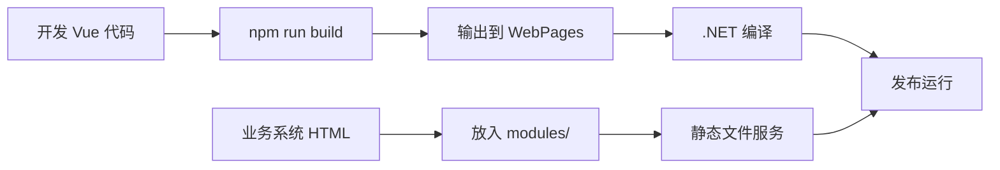

# QMSystem 前端项目

## 📁 目录结构

```
QMSystem-UI/                    # Vue 3 前端源码（开发用）
├── src/                   # Vue 源码
│   ├── views/            # 页面组件
│   ├── components/       # 通用组件
│   ├── stores/          # Pinia 状态管理
│   └── main.js          # 入口文件
├── package.json          # 依赖配置
├── vite.config.ts        # Vite 构建配置
└── README.md            # 本文档

QMSystem/WebPages/        # 编译产物（生产用）
├── index.html           # 主页面
├── login.html          # 登录页面
├── assets/             # 编译后的静态资源
└── modules/            # 业务系统页面
```

## 🚀 开发流程

### 1. 安装依赖
```bash
cd QMSystem-UI
npm install
```

### 2. 开发模式（前后端分离）
```bash
# 终端1：启动后端
cd QMSystem
dotnet run

# 终端2：启动前端（热重载）
cd QMSystem-UI
npm run dev
```

访问：`http://localhost:5173`

### 3. 生产构建
```bash
cd QMSystem-UI
npm run build
```

构建产物会自动输出到 `../QMSystem/WebPages/`

## 🔧 架构特点

### 微前端接入
- 作为 **qiankun 子应用** 挂载至底座系统。
- 生产环境构建基础路径 (`base`) 设置为 `/qm/`，编译产物自动归档于 `QMSystem/WebPages/`，再由宿主动态托管。
- 微前端模式下使用 `memory history` 路由，并在 `hashchange` 事件中与主应用保持 hash 同步。

### 路由与菜单自动上报
- 路由定义于 `src/router/qms_menu.json`，子应用挂载时会自动将路由表上报给主框架，由主框架动态组装并渲染左侧导航。
- 去除了硬编码的旧前缀（如 `/quality/`），路由规则独立解耦。

### 多语言联动同步
- 监听 `props.onGlobalStateChange` 状态，当主应用切换语言（zh / en）时，实时调用 `setLanguage` 进行 locale 的同步切换，无需刷新。

## 📝 开发规范

### 添加新页面与路由
1. 在 `src/views/` 下编写新的业务 Vue 组件。
2. 在 `src/router/qms_menu.json` 中配置对应的路由与菜单元数据（如 `title`，`iconClass`，`order` 等）。
3. 运行 `npm run build` 更新生产文件。

### 样式规范
- 使用 Composition API
- 统一的深色主题
- 响应式设计

## 🎯 部署说明

### 开发环境
1. 启动后端：`dotnet run --project QMSystem`
2. 启动前端：`npm run dev`
3. 访问：`http://localhost:5173`

### 生产环境
1. 构建前端：`npm run build`
2. 构建后端：`dotnet build`
3. 运行：`dotnet run --project QMSystem`
4. 访问：`http://localhost:7701`

### 发布部署
1. 运行 `npm run build`
2. 删除 `QMSystem-UI/` 目录（可选）
3. 发布 QMSystem
4. 用户直接运行 .exe 即可

## 🔄 工作流程


```mermaid
graph LR
    A[开发 Vue 代码] --> B[npm run build]
    B --> C[输出到 WebPages]
    C --> D[.NET 编译]
    D --> E[发布运行]
    
    F[业务系统 HTML] --> G[放入 modules/]
    G --> H[静态文件服务]
    H --> E
```

这种架构实现了：
- ✅ 源码保护
- ✅ 开发体验
- ✅ 自动化构建
- ✅ 业务系统独立
- ✅ 一键部署
